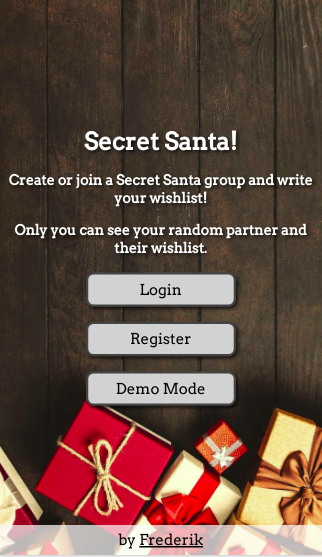

# Secret Santa

## Introduction
Create or join [Secret Santa](https://en.wikipedia.org/wiki/Secret_Santa "Wikipedia") groups. A demo mode is available to check out the site without registering.

Groupowners get access to administrative options: 
* removing groupowners
* deleting a group
* assigning secret santas
* inviting groupmembers

Joining groups requires the groupname and a code.

Secret santa partners are randomly generated and hidden from other groupmembers. Groupmembers can create wishlists that only their secret santa can view.

***

## Final Project
https://peaceful-oasis-32890.herokuapp.com

***

## Behind the scenes
### Frontend:
* Angular

### Backend:
* Node
* Express
* Mongoose
* Passport

### Database:
* MongoDB

### Hosting:
* Heroku
* mLab

***

## Preview Images
### Main Screen:

### Mobile Main Screen:

### Groups View:

### Groupmembers View:

### Wishlist View:

